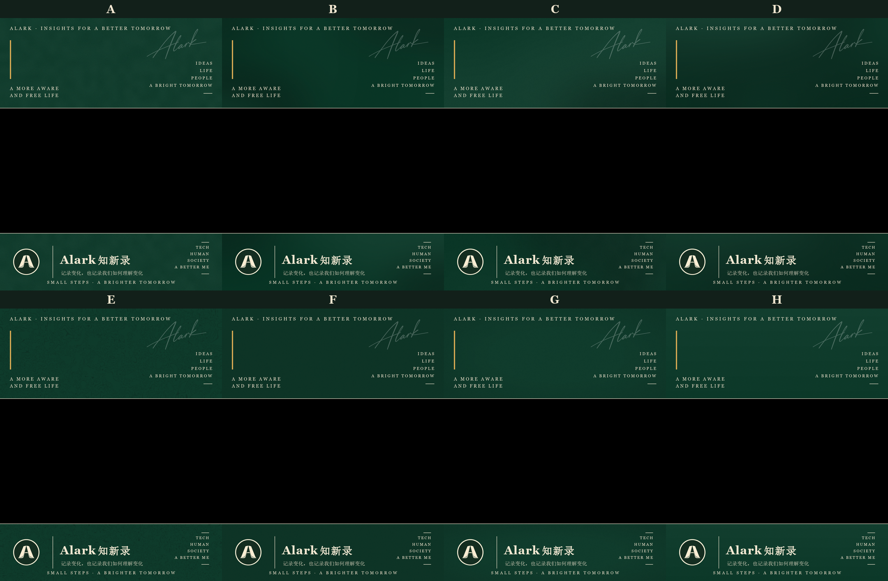

# Alark Frame v1.0 · 背景纹理探索记录

2026-09-23，针对 Header/Footer 背景纹理做了一轮 8 版本（A–H）的横向比较实验。
所有版本共享同一套冻结元素（布局、文案、字体、Logo、签名、配色、分隔线完全一致），
仅背景纹理不同；中间 1080×608 黑色占位区在所有版本中保持纯黑。

**结论：E（等高线版）已被选定为正式版本**，固化进 `../../config/frame_v1.yaml`
的 `texture` 配置节，正式资产由 `../../scripts/generate_frame.py` 生成
（输出与 `frame_v1_E.png` 逐像素一致）。其余版本文件保留备查。

复现全部 8 个版本与对照图：

```bash
python scripts/generate_texture_variants.py
```

## 对照总览



## 各版本说明

### A · 纯纸张颗粒 — [frame_v1_A.png](frame_v1_A.png)

高级印刷纸/棉纸质感，无明确图形。手法：低分辨率随机噪点放大成柔和明暗斑驳
（模拟棉纸纤维的缓慢起伏，alpha=4），再叠全幅细颗粒（alpha=7）。

### B · 墨雾 — [frame_v1_B.png](frame_v1_B.png)

深绿里非常淡的不规则烟雾/墨迹，不形成山、水、云的明确形状。手法：9 个随机
椭圆墨团（颜色相对主背景偏移 ±4~8），经大半径高斯模糊（0.10×长边）融成雾气，
收尾细颗粒 alpha=3。

### C · 纸张 + 墨雾 — [frame_v1_C.png](frame_v1_C.png)

A 的纸感斑驳打底 + 7 个柔和墨团（偏移 ≤7，模糊 0.11×长边）+ 细颗粒 alpha=6，
追求高级杂志封底的复合质感。

### D · 抽象光影 — [frame_v1_D.png](frame_v1_D.png)

棚拍背景布式的柔光与暗部：顶部偏左大柔光团（提亮 9）、两个底角暗团
（压暗 7/8），0.14×长边高斯模糊，无科技光束感；细颗粒 alpha=3。

### E · 等高线 ✅ 正式版本 — [frame_v1_E.png](frame_v1_E.png)

极细极淡的拓扑等高线，纸面地图般的安静纹理。手法：36×14 低分辨率随机场经
BICUBIC 放大成平滑标量场，按 8 个等值层级（场值 42–220、步长 22）提取 ±1
容差带，BILINEAR 放大 + 1px 高斯柔化成软线；线色相对主背景提亮 26、
峰值透明度 70，收尾细颗粒 alpha=3。

> 已固化：正式参数见 `../../config/frame_v1.yaml` 的 `texture.contour`，
> 由 `../../scripts/generate_frame.py` 生成正式资产。

### F · 细腻布纹 — [frame_v1_F.png](frame_v1_F.png)

高级布料/书封织物质感。手法：每 3px 的横/竖细织纹两层（颜色偏移 6，
横向 alpha=90、纵向 alpha=75，有效偏移仅约 2），叠加细颗粒 alpha=4；
近看有织物经纬感，正常观看距离无明显重复图案。

### G · 胶片颗粒 + 暗角 — [frame_v1_G.png](frame_v1_G.png)

极轻胶片 grain（alpha=6）+ 四周微弱径向暗角（峰值 alpha 26，约压暗 10%）。
暗角按 Header、Footer 各自区域单独施加，中间黑色占位区不受任何影响。

### H · 几乎纯色 — [frame_v1_H.png](frame_v1_H.png)

最极简基准：仅顶部 +3 → 底部 -3 的极轻垂直明暗渐变 + 细颗粒 alpha=4，
视觉上接近纯色深墨绿。

## 备注

- 所有版本固定 seed（`texture.seed: 20260923`），输出完全可重复。
- 冻结一致性经脚本校验：以 A 版为基准 diff 暖米白文字/Logo 像素掩码，
  各版本差异 <0.03%，全部来自文字抗锯齿边缘与不同底色的混合，属预期。
